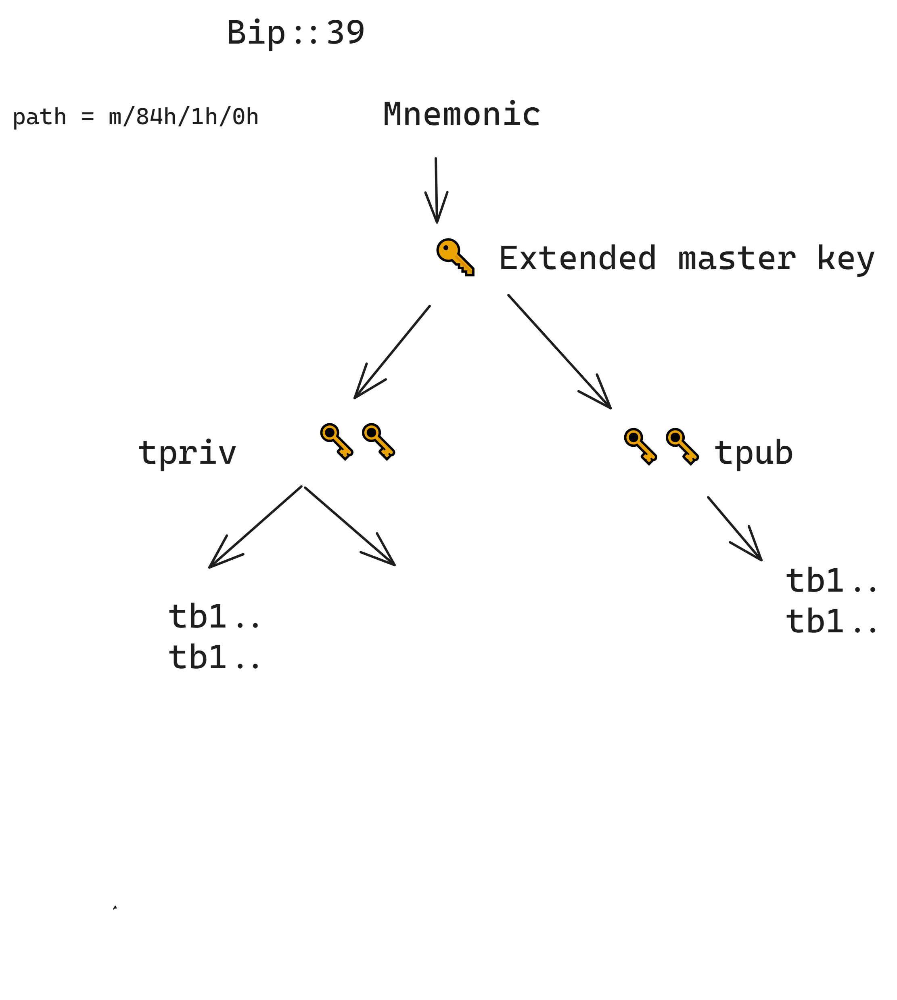

---


```bash
Eg: Output 
path: m/84'/1'/0'
xpub :  [daca9160/84'/1'/0']tpubDCENPMJHekKJ9omxM7dK9ug7xcorPjGoiemKahpbgSv7sh6yhGbKh7h6b1yW6XNvKv2VhhpFLmcTjZVj4EBnRQtLi4CgCjReMfSkyn6JjMS/*
xprv :  [daca9160/84'/1'/0']tprv8fYLEwG3WNddGLkATTxikW21PbHvEQ5u9MAYJBnJGB7j3CrD4smjWd5EQtwDhayBZQvxd8L3pPFmDRTQ5FBsHaJfeUaMNNis74QxTLqLvvq/*
 mnemonic: hazard symbol desert stairs eyebrow fit crouch slot rain all tumble apple
fingerprint: daca9160
derived_xprv: tprv8fYLEwG3WNddGLkATTxikW21PbHvEQ5u9MAYJBnJGB7j3CrD4smjWd5EQtwDhayBZQvxd8L3pPFmDRTQ5FBsHaJfeUaMNNis74QxTLqLvvq
formating.. to withness privatekey hash +++ : wpkh([daca9160/84'/1'/0']tpubDCENPMJHekKJ9omxM7dK9ug7xcorPjGoiemKahpbgSv7sh6yhGbKh7h6b1yW6XNvKv2VhhpFLmcTjZVj4EBnRQtLi4CgCjReMfSkyn6JjMS/*)
Formatting.. child keys starting from the index 0: wpkh([daca9160/84h/1h/0h]tpubDCENPMJHekKJ9omxM7dK9ug7xcorPjGoiemKahpbgSv7sh6yhGbKh7h6b1yW6XNvKv2VhhpFLmcTjZVj4EBnRQtLi4CgCjReMfSkyn6JjMS/0/*)
Addresses derived with tpub
Address #0: tb1qspjuyytcl4zfeuqhq58zvam56gnn8eqv9faauh
Address #1: tb1q8l5lq8w4f7sk8gsaa9s0dujmednttjvphtch3l
Address #2: tb1qqax6k4pc3y79e9smjt2ddytll4v26cxxjxzle3
Formatting.. child keys starting from the index 0: wpkh([daca9160/84h/1h/0h]tprv8fYLEwG3WNddGLkATTxikW21PbHvEQ5u9MAYJBnJGB7j3CrD4smjWd5EQtwDhayBZQvxd8L3pPFmDRTQ5FBsHaJfeUaMNNis74QxTLqLvvq/0/*)
Addresses derived with tpriv
Address #0: tb1qspjuyytcl4zfeuqhq58zvam56gnn8eqv9faauh
Address #1: tb1q8l5lq8w4f7sk8gsaa9s0dujmednttjvphtch3l
Address #2: tb1qqax6k4pc3y79e9smjt2ddytll4v26cxxjxzle3


```

